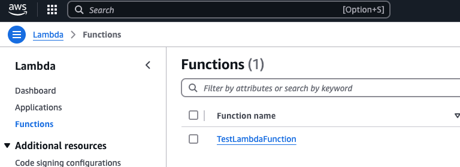

# Deploy Lambda Function with GitHub Actions and CloudFormation

## Motivation

We will test the deployment of Lamdba function via GitHub Actions.

## Overview

1. Log in AWS via sso.

2. Prepare simple Python function.

3. Test Lambda function from aws cli.

4. Create an IAM user for the deployment.

5. Edit GitHub Actions Workflow file

## Procedure

### Log in AWS via sso

```
aws login sso
```
Set [$AWS_PROFILE](https://docs.aws.amazon.com/ja_jp/cli/v1/userguide/cli-configure-envvars.html)
so that we do not need to attach '--profile XXXX' every time we execute aws cli.

### Prepare simple Python function

```
def handler(event, context):
    name = event.get("name", "Anonymous")
    weather = event.get("weather", "unknown")

    return {
        'statusCode': 200,
        'body': f"Hi {name}, hello from Lambda. It is {weather} today."
         'event': f'{event}',
         'context': f'{context}'
    }
```

```event``` carries payload (= arguments given at the command line. We will see them later).

Zip it (need a zip file to upload to Lambda Function).

```
zip lambda_test1.zip lambda_test1.py
```

### Create an IAM role to create and execute Lambda Function 

We need an IAM role to create and execute Lambda Function. 
An IAM role itself does not cost. 

First, create an role TestLambdaExecutionRole.
```
aws iam create-role \
    --role-name TestLambdaExecutionRole \
    --assume-role-policy-document file://trust-policy.json
```

```trust-policy.json ``` is so that Lambda Fucntion can 
use (=assume) this role. 

Attach AWSLambdaBasicExecutionRole policy to the role.
AWSLambdaBasicExecutionRole is an AWS managed policy.

```
aws iam attach-role-policy \
    --role-name TestLambdaExecutionRole \
    --policy-arn arn:aws:iam::aws:policy/service-role/AWSLambdaBasicExecutionRole
```

Save arn of the role. We will need it later.
```
aws iam get-role --role-name TestLambdaExecutionRole
```
Check it the role is created. 

```
aws iam list-roles --output json | jq
```
All right.

### Create Lambda Function with aws cli

```
aws lambda create-function \
    --function-name TestLambdaFunction \
    --runtime python3.9 \
    --role arn:aws:iam::************:role/service-role/TestLambdaExecutionRole \
    --handler lambda_test1.handler \
    --zip-file fileb://lambda_test1.zip
```
Replace the argument of '--role' to the arn of the role that we just created above. 

'--handler' consists of 'name of the file'.'name of the function'.

Let us check if the Lambda Function is there.



All right. 

### Test Lambda Function with aws cli
Create a payload ```event.json``` to hand in the Lambda Function.

```
{"name": "me",  "weather": "cold!"}
```

Then execute the following. 

```
aws lambda invoke --function-name TestLambdaFunction  \
  --cli-binary-format raw-in-base64-out \
  --payload file://event.json  output.json
```

It is not clear to me what '--cli-binary-format' means, 
but without it, the command does not work (the error message told
me to attach this line).  

The reply from the Lambda Function is stored in ```output.json```.
```
$ cat output.json
{"statusCode": 200, "event": "{'name': 'me', 'weather': 'cold!'}", 
....
}
```
All right. Delete the function.

```
aws lambda delete-function --function-name TestLambdaFunction
```
Check it on the console. 

### Deploy Lambda Function via GitHub Actions

Prepare GitHub Actions workflow file  at ```./.github/workflows/deploy-lambda.yaml```.
Make sure you create GitHub secrets beforehand. [See](https://github.com/megnergit/AWS_GitHub_Actions_Test_G1).
You might need update arn of the role TestLambdaFunction.

Then, push the updated files. 


<!-- ------------------------------  -->

# END

<!-- ####################  -->
